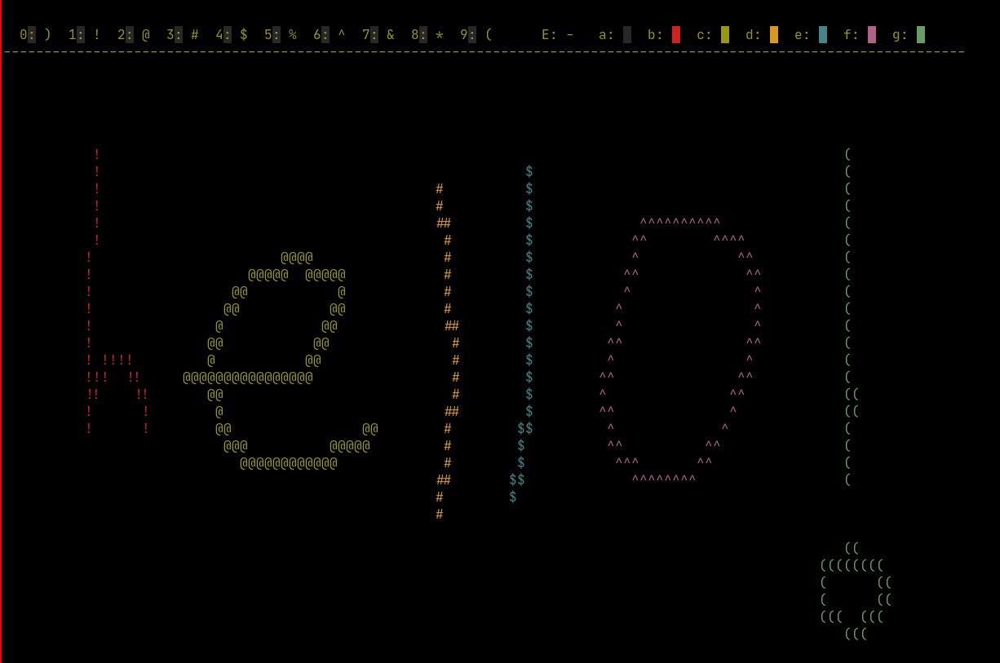

# ascii-art
A drawing program for in your terminal. Draw ascii art that you can copy directly from the terminal.

## How to install:
1. Install termbox development files: 
* Void Linux: xbps-install termbox-devel
* Debian based distros: apt install libtermbox-dev 
* Arch based distros: install the termbox-git package from the AUR.
2. git clone https://github.com/mathijskr/ascii-art
3. cd ascii-art
4. make

## How to run:
1. cd ascii-art
2. make run

Or to save your art directly to a file:
1. cd ascii-art
2. ./art > "your_filename"

## Dependencies:
* A c-compiler.
* GNU Make
* Termbox development files.
